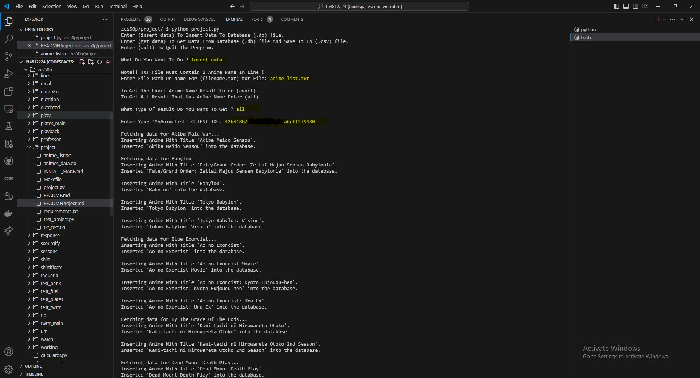
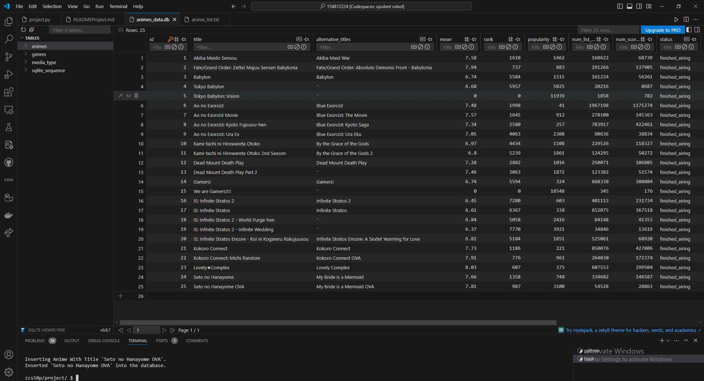
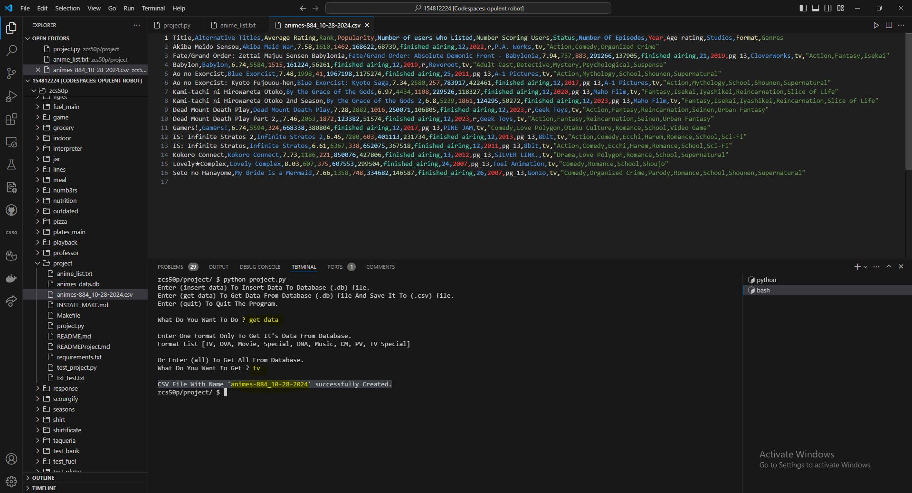
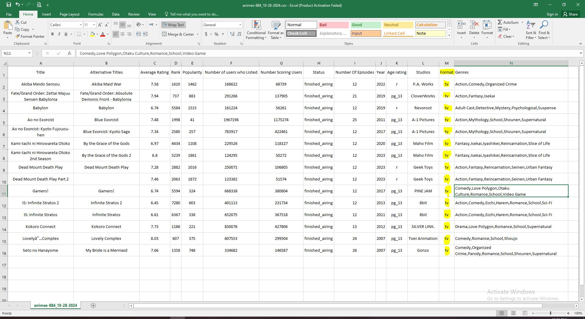

# _Scrap Anime Details From MyAnimeList API_

## Video Demo for the Project:  [Watch Here](https://www.youtube.com/watch?v=tJAo1f6BAxI)

## Description:

Fetch Data From MyAnimeList API And Save it To db file And Extract Data From db File And Save it in CSV file Based on Format Type Like [TV, OVA, Movie, Special, ONA, Music, CM, PV, TV Special]

## Installing Dependencies

1. **Clone** this repository to your Divice:

   ```bash
   git clone https://github.com/AhmedMansour024/CS50-Python-Final-Project
   ```

2. Run **make** in the Terminal To Create an Environment:

    ```bash
    make
    ```

     - **Or** Create an Environment manually [Here](https://github.com/AhmedMansour024/Create-Environment-and-Insatalling-Make/blob/36926bbaf26c1b7c0060df2228f4cdad95667c86/INSTALL_VENV.md) and install all necessary libraries By using:

       ```bash
        pip install -r requirements.txt
       ```

## How to Use The Program ?

   - Run `python project.py`.

**The Program Has Two features**

1. **Insert Data:**
    - if the user want to insert data to the database file.
    - then the program will ask about the **result type** Meaning:
        - if the user want to get the result extractly the same as the txt, Enter **exact.**
        - if the user want all result that Has **txt name** in it, Enter **all.**

    - after that user will enter his **CLIENT ID**, then the program will **start** fetching for all the anime in the **txt file** And Save it to the **db file**.

2. **Get Data**
    - if the user want to extract data from the database file by creating **CSV file.**
    - then the program will ask about **Format type** And There is Two Choices:
        - if user want one format only Like [**TV**, **OVA**, **Movie**, **Special**, **ONA**, **Music**, **CM**, **PV**, **TV Special**].
        - if the user want to get all formats **all**.

## Here is Some images

- Using **insert data**
- 
- **Database File**
- 
- Using **get data**
- 
- Displaying **CSV File** with Microsoft Excel
- 
